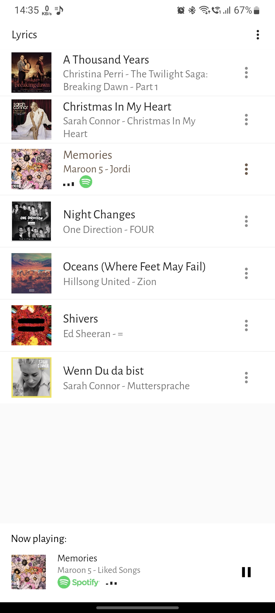
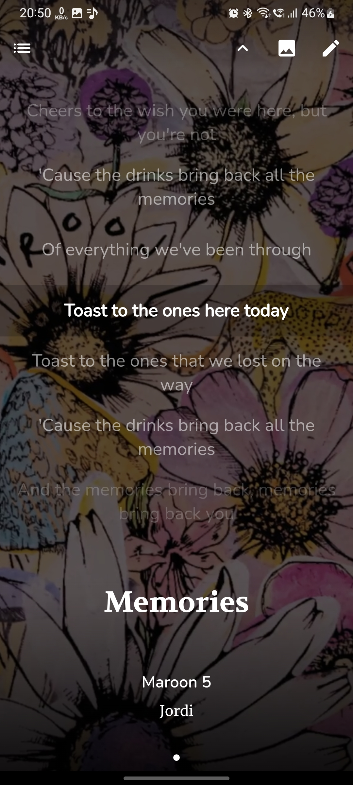
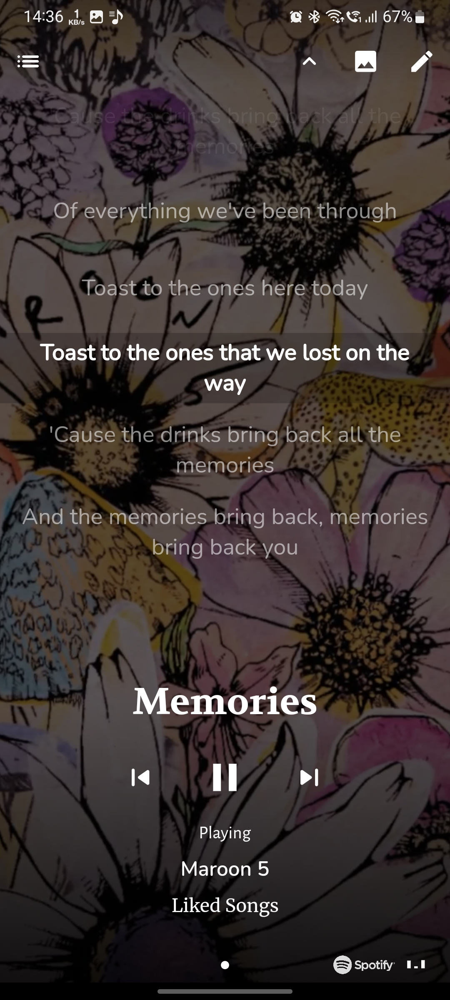
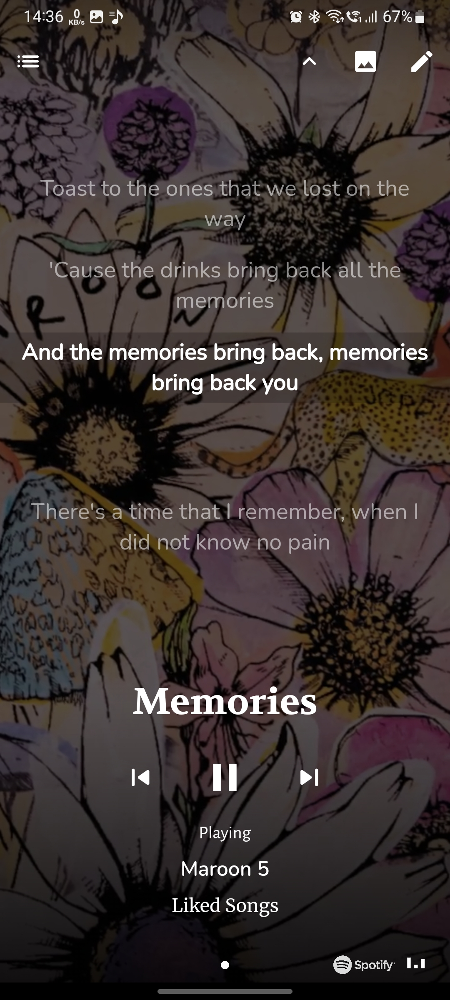

# lyrics

An app to read lyrics of your favourite music, playing on your preferred music player.

Clips are supported. Clips are just basically a short video that plays in place of displaying album art.

Enjoy your music with lyrics on a cozy background.

Screenshots:

   

Currently supported music players for currently playing music detection:
JioSaavn, Spotify

Upcoming support to music players:
Amazon Prime Music

## Build and run

To build this project, for that you must have Flutter SDK installed.
For guidance of installing Flutter SDK and running this app, please follow the instructions [here](https://docs.flutter.dev/get-started/install).

Please note that, this project is currently under development, there can be bugs and non-working features for that reason.
